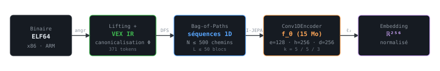
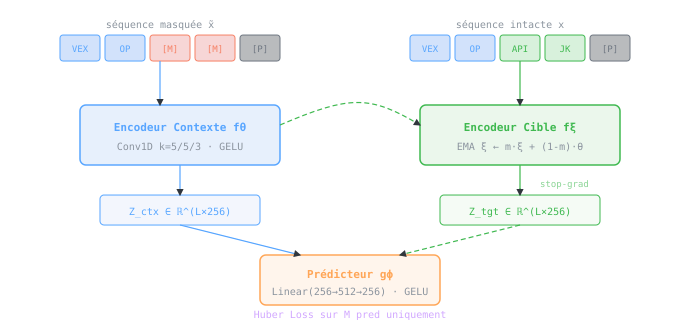

# Binary-JEPA

> **Hachage Sémantique de Binaires par Prédiction Latente Auto-Supervisée sur Bag-of-Paths VEX**  
> Working Paper — ING3 Cybersécurité, CY Tech, 2026

[](https://huggingface.co/rubenanko/binary-jepa)
[](reports/paper/)
[](https://www.python.org/)

---

## Vue d'ensemble

Binary-JEPA est une architecture de **hachage sémantique de binaires ELF64** fondée sur l'apprentissage auto-supervisé. Face à l'obsolescence des signatures cryptographiques classiques (MD5, SHA-256) face aux malwares polymorphes, ce projet propose de produire une empreinte **stable face aux transformations compilatoires** et, à terme, aux techniques d'obfuscation modernes.

### Pipeline



## Structure du dépôt

```
binary-jepa/
│
├── binary-jepa/                    ← Package d'entraînement (Python 3.12)
│   ├── src/
│   │   ├── models/
│   │   │   ├── jepa.py             ← IJEPA (context encoder + target encoder + predictor)
│   │   │   ├── encoder.py          ← Conv1DEncoder (fθ, fξ)
│   │   │   └── predictor.py        ← Prédicteur gϕ (MLP 2 couches)
│   │   ├── masks/
│   │   │   ├── random_token.py     ← Masquage aléatoire ← run convergent
│   │   │   ├── last_token.py       ← Masquage dernier token
│   │   │   └── noiseproof.py       ← Masquage par tiers (objectif I-JEPA 1D)
│   │   ├── preprocessing/
│   │   │   ├── vocab.py            ← Construction du vocabulaire + encodage dataset
│   │   │   └── dataset.py          ← BagOfPathsDataset (PyTorch)
│   │   ├── train/
│   │   │   └── default.py          ← Boucle d'entraînement + codecarbon
│   │   ├── test/
│   │   │   ├── encoder.py          ← Évaluation cosine/distance par paires
│   │   │   └── predictor.py        ← Évaluation mode prédicteur
│   │   └── visualization/          ← 4 panels : ASM · CFG · DFS · IDs
│   │       ├── pipeline_viz.py     ← Orchestrateur CLI
│   │       ├── cfg_panel.py
│   │       ├── paths_panel.py
│   │       ├── ids_panel.py
│   │       └── token_colors.py     ← Catégorisation sémantique des tokens
│   ├── data/                       ← 1 000 JSONL · 950 474 chemins · 318 M tokens
│   ├── encoded_dataset/
│   ├── vocab.json                  ← 371 tokens canoniques
│   ├── train.yaml
│   └── train.sh                    ← Lance l'entraînement + génère le rapport CSV
│
├── elf-processing/                 ← Pipeline d'extraction dataset
│   ├── src/elf_processing_core.py  ← BinaryAnalyzer (angr + DFS + VEX)
│   ├── external/dataGen/
│   │   └── generate_data.sh        ← Compilation GNU Coreutils (gcc/clang × 5 niveaux)
│   └── pipeline.sh                 ← Orchestrateur complet
│
├── latentSpace/
│   └── elf64-context-hash/         ← Paquet distribuable elf64ctx
│       ├── elf64_context_hash/
│       │   ├── cli.py              ← Interface CLI (-E / -C / -P / --plot)
│       │   ├── elf_processing.py   ← BinaryAnalyzer (miroir elf-processing)
│       │   ├── loaders.py          ← Chargement vocab + checkpoint HuggingFace
│       │   ├── model/
│       │   │   ├── encoder.py
│       │   │   └── predictor.py
│       │   └── constants.py
│       └── pyproject.toml
│
├── experiments/
│   ├── 0-firstOverview/            ← 12 ELF · 66 paires · heatmaps qualitatifs
│   └── 1-visualization/            ← Visualisation multi-panels du pipeline
│
├── reports/paper/                  ← Working paper (LaTeX / arxiv.sty)
├── requirements.txt
└── README.md
```

---

## Dataset

Le dataset d'entraînement est généré automatiquement à partir de **GNU Coreutils 9.10** compilé en cross-compilation contrôlée :

```
C × O = {gcc, clang} × {-O0, -O1, -O2, -O3, -Os}
→ 106 utilitaires × 10 variants = 1 060 fichiers ELF (strip --strip-all)
```

| Métrique                          | Valeur           |
| --------------------------------- | ---------------- |
| Chemins totaux                    | 950 474          |
| Duplicats inter-binaires          | **74.6 %**       |
| Tokens distincts (vocab)          | 371              |
| Entropie de Shannon               | 3.53 / 8.53 bits |
| Top 5 tokens                      | 67.8 % du corpus |
| `VEX_REG_WRITE` seul              | 27.4 % du corpus |
| Longueur médiane / chemin         | 263 tokens       |
| Tokens distincts médians / chemin | 16               |

> [!Note]
> Le taux de duplicats élevé (74.6 %) n'est pas surprenant — deux compilations d'une même fonction partagent un long préfixe commun dans le CFG. La divergence significative n'apparaît généralement qu'après la position ~50. L'outil de visualisation gère cela via `_trim_common_prefix()`. Toutefois, un raffinement du langage intermédiare est prévu, et une densification du dataset d'entraînement aussi.

---

## Installation

### 1. Inférence uniquement — `elf64ctx`

```bash
pip install -e latentSpace/elf64-context-hash/
```

Le vocabulaire (`vocab.json`) et le checkpoint (`latest.pt`, ~15 Mo) sont téléchargés automatiquement depuis [`rubenanko/binary-jepa`](https://huggingface.co/rubenanko/binary-jepa) au premier import, dans `~/.elf64-context-hash/`.

**Dépendances** : `torch`, `angr`, `networkx`, `pebble`, `tqdm`, `huggingface_hub`

### 2. Entraînement — package complet

```bash
# Environnement virtuel recommandé (Python 3.12)
python -m venv .venv && source .venv/bin/activate
pip install -r requirements.txt

# Dépendances système pour angr
pip install angr networkx pebble
```

---

## Utilisation

### Encoder un binaire ELF

```bash
elf64ctx -E ./mon_binaire.elf
# → output/mon_binaire.elf-embeddings.json
#   {nom_fonction: [embedding_b64, ...]}
```

### Comparer deux binaires

```bash
# Toutes les paires de fonctions
elf64ctx -C binaire_A.elf-embeddings.json binaire_B.elf-embeddings.json

# Avec heatmap (colormap plasma_r)
elf64ctx -C binaire_A.elf-embeddings.json binaire_B.elf-embeddings.json --plot

# Deux fonctions spécifiques
elf64ctx -C A.json B.json -F main main

# Mode prédicteur (sortie de gϕ à la position <MASK>)
elf64ctx -E ./mon_binaire.elf -P
```

### Visualiser le pipeline (offline, sans angr)

```bash
cd binary-jepa/binary-jepa

python -m src.visualization.pipeline_viz \
    /path/to/binary.elf 0x40e6f3 \
    --no-angr \
    --jsonl-dir     experiments/1-visualization/data/ \
    --encoded-dir   experiments/1-visualization/encoded_dataset/ \
    --vocab         vocab.json \
    --out           output/result.png \
    --separate          # un PNG par panel (recommandé pour les grands CFGs)
```

Fonctions avec bonne diversité de chemins :

- `ls_gcc_O0.jsonl` → `0x414d41` (beaucoup de BBs, chemins diversifiés)
- `ls_clang_Os.jsonl` → `0x40e6f3`

---

## Entraînement

```bash
cd binary-jepa/binary-jepa

# 1. Générer le dataset ELF
cd ../../elf-processing && bash pipeline.sh

# 2. Construire le vocabulaire
python -m src.preprocessing.vocab data/ --out vocab.json --min_freq 2

# 3. Encoder le dataset
python -m src.preprocessing.vocab data/ --with-vocab vocab.json

# 4. Sérialiser en raw_data
python -m src.preprocessing.vocab encoded_dataset/ --save-raw raw_data500.json

# 5. Lancer l'entraînement (+ rapport graphique automatique)
bash train.sh --config_path train.yaml
```

**Configuration** (`train.yaml`) :

```yaml
train_data_path: raw_data500.json
vocab_path: vocab.json
epoch: 10
batch_size: 10
learning_rate: 1e-4
use_checkpoint: false
checkpoint_path: latest.pt
```

L'empreinte carbone est tracée automatiquement via `codecarbon`.

---

## Historique des runs

Trois runs archivés sur [`rubenanko/binary-jepa`](https://huggingface.co/rubenanko/binary-jepa) :

| Run            | Stratégie masquage | LR     | Batch | Perte finale | Statut                 |
| -------------- | ------------------ | ------ | ----- | ------------ | ---------------------- |
| `10-03-2026`   | Tiers consécutifs  | 5×10⁻⁵ | 20    | 512.88       | ❌ divergence          |
| `last-token`   | Dernier token      | 10⁻⁴   | 10    | 5.81         | ⚠️ instabilité tardive |
| `random-token` | Token aléatoire    | 10⁻⁴   | 10    | **0.030**    | ✅ convergent          |

Le checkpoint de référence (`latest.pt`) correspond au run `random-token`, époque 10.

---

## Architecture I-JEPA 1D



---

## Artefacts HuggingFace

| Artefact        | Description                                             |
| --------------- | ------------------------------------------------------- |
| `latest.pt`     | Checkpoint de référence (run `random-token`, époque 10) |
| `vocab.json`    | Vocabulaire canonique (371 tokens)                      |
| `random-token/` | ✅ Run convergent — plateau à L=0.030                   |
| `last-token/`   | ⚠️ Instabilité tardive à l'époque 8                     |
| `10-03-2026/`   | ❌ Divergence catastrophique (L=512 ep10)               |

---

## Résultats préliminaires

Validation qualitative sur 12 binaires GNU Coreutils  
(`gcc`/`clang` × {`-O0`, `-O3`, `-Os`}, `strip --strip-all`) :

| Type de paire                                      | Distances  | Interprétation                        |
| -------------------------------------------------- | ---------- | ------------------------------------- |
| Positive (même programme, compilateurs différents) | [0.0, 1.0] | Invariance partielle à la compilation |
| Négative (programmes différents, même compilateur) | [0.6, 1.0] | Séparabilité inter-programmes         |
| Mixte (programmes + compilateurs différents)       | [0.0, 3.0] | Effet super-additif                   |

---

## Limites connues

- **Taux de duplicats élevé (74.6 %)** — les fonctions partagent un long préfixe commun inter-compilateurs. Un échantillonnage contrastif inter-binaires serait plus efficace pour I-JEPA.
- **Verbosité VEX IR** — les tokens structurels (`WrTmp`, casts de types) représentent ~33.5 % du corpus avec peu de signal sémantique.
- **Vocabulaire effectif restreint** — les 20 premiers tokens couvrent 98.9 % du corpus. Les séquences sont très répétitives.
- **Champ réceptif Conv1D limité à 13 tokens** — incompatible avec la stratégie de masquage par tiers (objectif théorique de I-JEPA 1D). Un encodeur à champ global (Mamba, Longformer) est nécessaire.
- **Validation obfuscation absente** — la résilience face à CFF/BCF reste à valider empiriquement sur des binaires OLLVM.

---

## Feuille de route

- [ ] Recall@k · MRR · AUC sur les 1 060 ELF du corpus
- [ ] Validation CFF/BCF (OLLVM) — légitimation formelle du Bag-of-Paths
- [ ] Analyse UMAP/t-SNE des embeddings latents
- [ ] Ablation systématique des stratégies de masquage (_curriculum masking_)
- [ ] Extension architecture (Mamba/Longformer) pour champ réceptif global
- [ ] Quantification INT8 + mode _fingerprint_ (Hamming O(1))
- [ ] Extension corpus (noyau Linux, OpenSSL, FFmpeg) + fine-tuning malwares

---

## Citation

```bibtex
@techreport{bouchou2026binaryjepa,
  title       = {Binary-{JEPA} : Hachage S{\'e}mantique de Binaires par
                 Pr{\'e}diction Latente Auto-Supervis{\'e}e sur Bag-of-Paths {VEX}},
  author      = {Bouchou, Ryan and Petteng-Ngongang, Ruben},
  year        = {2026},
  month       = {mars},
  type        = {Working Paper},
  institution = {CY Tech},
  note        = {\url{https://gitlab.com/iRyann/binary-jepa}}
}
```

---

## Auteurs

**Ryan Bouchou** — [ryanbouchou.fr](https://ryanbouchou.fr) · [ORCID 0009-0001-5714-3438](https://orcid.org/0009-0001-5714-3438)  
**Ruben Petteng-Ngongang**

ING3 Cybersécurité — CY Tech, Pau, 2026
